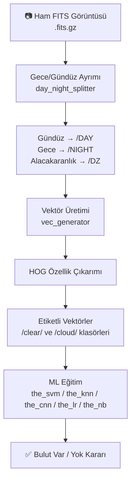

# 🌤️ DAG Cloud Detection — Kod & Dataset Rehberi

> **Amaç**: DAG (Doğu Anadolu Gözlemevi) yerleşkesindeki **All-Sky Camera (ASC)** ile çekilen FITS görüntülerinden otomatik bulut tespiti yapmak.

---

## 📁 Proje Yapısı

```
cloud_detection/
├── main.py              ← Ana pipeline (tüm adımlar burada çağrılır)
├── dag_cld/
│   ├── env.py           ← Logger + dosya işlemleri (yardımcı araçlar)
│   ├── ast.py           ← Görüntü işleme + Astrofizik hesapları
│   ├── mask.py          ← Gökyüzü maskesi oluşturma
│   └── teacher.py       ← ML modelleri (SVM, KNN, CNN, LR, NB)
├── test_classifiers.ipynb
└── test_yetenekler.ipynb
```

---

## 🔄 Projenin Çalışma Akışı (Pipeline)



---

## 📦 Modüller Tek Tek Açıklaması

### 1. `env.py` — Yardımcı Araçlar

| Sınıf | Ne Yapar? |
|-------|-----------|
| `Logger` | Her işlemi timestamp ile konsola/dosyaya yazar. `blabla=True` ise ekrana basar. |
| `File` | Dosya listeleme (`glob`), taşıma (`shutil`), yol ayrıştırma işlemleri |

```python
logger = env.Logger(blabla=True)   # konsola log bas
fop = env.File(logger)             # dosya operasyonları
files = fop.list_in_path("D:/asc/night/*.gz")  # dosyaları listele
```

---

### 2. `ast.py` — Görüntü + Astronomi

#### `Image` Sınıfı — Görüntü İşleme

| Metod | Ne Yapar? |
|-------|-----------|
| `array2rgb(data)` | FITS'ten gelen `[R, G, B]` array'ini görüntüye çevirir |
| `rgb2gray(rgb)` | Renkli → Gri tonlamalı dönüşüm (skimage) |
| `resize(array, "25%")` | Görüntüyü yüzdesel veya piksel boyutuna küçültür |
| `find_window(masked)` | Maskelenmiş görüntüden sıfır olmayan bölgeyi keser (bounding box) |
| `hog(image)` | **HOG (Histogram of Oriented Gradients)** özellik vektörü üretir |
| `normalize(array)` | Piksel değerlerini 0–1 arasına getirir |
| `show(array)` | Görüntüyü matplotlib ile ekranda gösterir |

> **HOG nedir?** Görüntüdeki kenar yönlerinin histogramını çıkarır. Bulutların difüz (bulanık) yapısı ile açık gökyüzünün keskin yıldız noktalarını birbirinden ayırt etmek için kullanılır.

#### `Fits` Sınıfı — FITS Dosya İşleme

```python
data   = fts.data("goruntu.fits.gz")    # NumPy array olarak piksel verileri
header = fts.header("goruntu.fits.gz")  # Tarih, teleskop bilgisi vb.
fts.write("cikti.fits.gz", data, header)
```

#### `Time` & `TimeCalc` — Astronomi Zamanı

```python
# Verilen UTC zamanının gece mi gündüz mü olduğunu hesaplar
dp = timeCalc.day_part(utc)
# dp = 1  → Gece (astronomik alacakaranlıktan sonra)
# dp = 0  → Gündüz
# dp = -1 → Alacakaranlık geçiş bölgesi
```

**Neden önemli?** Gündüz çekilen görüntülerde güneş var, gece yoktur → Aynı ML modeli her ikisi için çalışmaz, ayrılmaları gerekir.

#### `Site` — DAG Konumu

```python
lat = coord.create("41.2333 degree")  # Kuzey enlemi
lon = coord.create("39.7833 degree")  # Doğu boylamı
ele = 3170                             # Rakım (metre) — DAG'ın yüksekliği
```

---

### 3. `mask.py` — Gökyüzü Maskesi

All-Sky Camera görüntüsü dairesel bir ayna yansımasıdır. Gökyüzünü 8 bölgeye böleriz:

```
mask_coordinates = {
    "E":  yatay-doğu    (irtifa 20-70°, azimut 45-135°)
    "S":  yatay-güney   (irtifa 20-70°, azimut 135-225°)
    "W":  yatay-batı    (irtifa 20-70°, azimut 225-315°)
    "N":  yatay-kuzey   (irtifa 20-70°, azimut 315-405°)
    "ZE": zenit-doğu    (irtifa 70-90°, azimut 45-135°)
    "ZS": zenit-güney   (irtifa 70-90°, azimut 135-225°)
    "ZW": zenit-batı    (irtifa 70-90°, azimut 225-315°)
    "ZN": zenit-kuzey   (irtifa 70-90°, azimut 315-405°)
}
```

`Polar.altaz()` → İrtifa (altitude) ve azimut'a göre dairesel dilim maskesi oluşturur

```python
the_mask = pmask.altaz(gray.shape,
                       altitude_range=(20, 70),
                       azimut_range=(45, 135),
                       rev=True)   # rev=True → maskenin dışını sıfırla
masked_data = pmask.apply(gray, the_mask)
```

---

### 4. `teacher.py` — Makine Öğrenmesi Modelleri

Tüm sınıflar `Teacher` base class'ından türer. Ortak metodlar:

| Metod | Açıklama |
|-------|----------|
| `class_adder(array, label)` | Veriye etiket sütunu ekler (1=açık, 0=bulutlu) |
| `class_combiner(a1, a2)` | İki sınıfı birleştirir |
| `shuffle(array)` | Karıştırır |
| `tts(array, test_size=0.20)` | Train/Test split (%80-%20) |
| `accuracy(y_test, predict)` | F1, Precision, Recall, ROC-AUC gibi 8 metrik döndürür |
| `save(clsf, file)` | Modeli `.clsf` olarak kaydeder (joblib) |
| `load(file)` | Kaydedilen modeli yükler |

#### Desteklenen Modeller:

```
SVM  → Support Vector Machine (sklearn, linear kernel)
KNN  → K-Nearest Neighbors (sklearn, k=3)
LR   → Logistic Regression (sklearn)
NB   → Naive Bayes (Gaussian/Bernoulli/Categorical/Complement/Multinomial)
CNN  → Convolutional Neural Network (TensorFlow/Keras)
         Conv2D(256) → MaxPool → Conv2D(256) → MaxPool → Flatten → Dense(64) → Sigmoid
```

---

## 📂 Dataset — Ne Gerekiyor?

> ⚠️ GitHub deposunda dataset yok. Dataset aşağıdaki yapıda **elle oluşturulması** gerekiyor.

### Beklenen Klasör Yapısı

```
D:/asc/
├── night/              ← Ham FITS görüntüleri (gece)
│   ├── 2019_11_28__22_30_00.fits.gz
│   ├── 2019_11_28__22_35_00.fits.gz
│   └── ...
│   ├── clear/          ← Açık gökyüzü görüntülerinin vektörleri
│   │   ├── 2019_11_28__22_30_00_E.fits.gz   (HOG görüntüsü)
│   │   ├── 2019_11_28__22_30_00_E_vec.fits.gz (HOG vektörü)
│   │   └── ...
│   └── cloud/          ← Bulutlu görüntülerin vektörleri
│       ├── ...
│       └── ...
└── day/                ← Gündüz görüntüleri (benzer yapı)
```

### Dataset Oluşturma Adımları

#### Adım 1: Ham FITS dosyaları temin et
- DAG teleskopunun All-Sky Camera'sından alınan `.fits` veya `.fits.gz` dosyaları
- Her dosya adı `YYYY_MM_DD__HH_MM_SS.fits.gz` formatında olmalı
- Alternatif kaynak: [ALLSKY CAM açık veri arşivleri](#alternatif-public-datasetler)

#### Adım 2: Gece/Gündüz ayır
```python
day_night_splitter("D:/asc/ham_goruntüler")
# → D:/asc/ham_goruntüler/NIGHT/  ve  /DAY/  klasörleri oluşur
```

#### Adım 3: HOG vektörleri üret
```python
vec_generator("D:/asc/night")
# Her görüntü için 8 yön × 2 dosya = 16 dosya üretir
```

#### Adım 4: **Manuel etiketleme** (en kritik adım!)
- `vec_generator` çıktısındaki görüntüleri **gözle inceleyerek**
- Açık gökyüzü → `/clear/` klasörüne taşı
- Bulutlu → `/cloud/` klasörüne taşı

#### Adım 5: Model eğit
```python
for res in the_svm("D:/asc/night"):
    print(res)  # [direction, accuracy, balanced_acc, ...]
```

---

## 🌐 Alternatif Public Datasetler (Dataset Yoksa)

Kendi görüntünü oluşturana kadar test etmek için:

| Dataset | URL | Açıklama |
|---------|-----|----------|
| **SWIMSEG** | [github.com/Someones SWIMSEG](https://github.com/Someones) | Singapore all-sky bulut segmentasyon |
| **HYTA** | [HYTA Dataset](https://github.com/manncodes/cloud_detection) | Hong Kong all-sky görüntüleri |
| **SWINySEG** | [Farhan et al.](https://paperswithcode.com/dataset/swimseg) | Segmentasyon veri seti |
| **SKYFINDER** | [vision.ist.ufl.edu](http://vision.ist.ufl.edu/cyl/sky) | Genel gökyüzü görüntüleri |

> 💡 **Tavsiye**: Önce SWIMSEG veya HYTA ile sistemi test edip doğru çalıştığını gör, sonra DAG verisi geldiğinde gerçek sisteme geç.

---

## 🧪 Kodu Test Etmek İçin Minimum Setup

### Adım 1: Paketleri yükle

```bash
pip install scikit-learn scikit-image tensorflow astropy astroplan sep numpy matplotlib opencv-python Pillow
```

> ⚠️ `sep` paketi bazen derleme gerektirir. Windows'ta sorun çıkarsa: `pip install sep --pre`

### Adım 2: Test görüntüsü oluştur (dataset yokken)

```python
import numpy as np
from astropy.io import fits

# Sahte bir all-sky camera görüntüsü oluştur
# Gerçek FITS: 3 katmanlı (R, G, B) 2D array
fake_image = np.random.randint(100, 5000, (3, 512, 512)).astype(np.float64)

# Bazı pikselleri "bulut" gibi yap (yüksek uniform bölgeler)
fake_image[:, 200:300, 200:350] = 8000  # parlak, düz bölge → bulut

fits.writeto("test_goruntu.fits", fake_image, overwrite=True)
```

### Adım 3: show_data ile görüntüyü incele

```python
# main.py'den
show_data("test_goruntu.fits")
# → Görüntü + HOG'u yan yana gösterir
```

---

## 📊 HOG Nasıl Çalışır? (Sunum için)

```
Ham Görüntü (512×512)
    ↓
Gri Tonlamalı Dönüşüm
    ↓
Maske Uygulaması (örn. Kuzey bölgesi)
    ↓  
Bounding Box Kırpma (sıfır olmayan bölge)
    ↓
HOG Hesaplama
   - 16×16 piksel hücreler
   - 8 yön gradyanı
   - Özellik vektörü oluşturulur (sayısal)
    ↓
SVM/KNN/LR gibi ML modeline girer
    ↓
Karar: BULUTLU (0) / AÇIK (1)
```

**Neden HOG?**
- Işık değişimlerine karşı dayanıklı
- Bulutların "dağınık" gradient yapısı vs yıldızların "nokta" yapısı ayrımı
- Hesaplama açısından verimli (CNN'e göre çok daha hızlı)

---

## 🎯 Staj Sunumu İçin Önerilen Anlatım Akışı

1. **Problem**: Gözlemevlerinde gece gözlem planlaması bulut durumuna bağlı → Otomatik tespit gerekli
2. **Donanım**: DAG All-Sky Camera → Balık gözü lens → Tam gökyüzü görüntüsü
3. **Veri Formatı**: FITS (Flexible Image Transport System) → Astronomide standart
4. **Ön İşleme**: Gece/gündüz ayırma → Astronomi hesapları (gün batımı/doğumu)
5. **Özellik Çıkarımı**: Gökyüzünü 8 bölgeye böl → Her bölge için HOG vektörü
6. **Sınıflandırma**: 5 farklı ML algoritması karşılaştırması
7. **Değerlendirme**: 8 farklı metrik (Accuracy, F1, ROC-AUC, Precision, Recall...)
8. **Sonuç**: Hangi yön, hangi zaman, hangi model en iyi çalışıyor?

---

## ⚠️ Bilinen Sorunlar / Dikkat Edilecekler

| Sorun | Çözüm |
|-------|-------|
| `multichannel` parametresi eski skimage'da farklı | `channel_axis=-1` ile değiştir (yeni skimage) |
| `tensorflow` import hatası | `pip install tensorflow==2.10` veya `pip install tensorflow-cpu` |
| Dataset yok | SWIMSEG veya sahte veri ile başla |
| Dosya adı formatı önemli | `YYYY_MM_DD__HH_MM_SS.fits.gz` formatına uy |
| `D:/asc/night` hardcoded | `main.py` son satırında değiştir |

---

## 🔗 Faydalı Linkler

- [DAG Project GitHub](https://github.com/DAGProject/cloud_detection)
- [FITS Format Açıklaması](https://fits.gsfc.nasa.gov/)
- [HOG Algoritması](https://scikit-image.org/docs/stable/api/skimage.feature.html#skimage.feature.hog)
- [Astroplan Docs](https://astroplan.readthedocs.io/)
- [SEP (Source Extractor in Python)](https://sep.readthedocs.io/)
